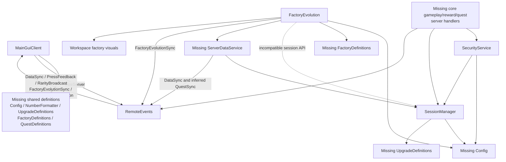

# Lucky Core Factory: Current Recovered System

## Scope and evidence rules

This document describes only the four salvaged scripts in `recovery/studio`. A **required interface** is directly referenced by surviving code. **Strongly inferred behavior** follows from call sites or comments but is not fully specified. An **unknown balance value** cannot be reconstructed from these files. A **recommended safe default** is explicitly labeled and is not claimed to be original.

## 1. Surviving Files

### `MainGuiClient.client.lua`

- **Responsibility:** Builds the complete `MainGui` UI, caches player data, displays core stats and rewards, sends player actions, and renders press/factory feedback.
- **Public API:** None; this is a `LocalScript`. It defines a global `updateUI()` within its environment. All other helpers are local.
- **Data read:** Client cache fields `Energy`, `LifetimeEnergy`, calculated `ClickPower`, `AutoPower`, `CoreAmplifier`, `Luck`, `Rebirths`, `Gems`, `UpgradeLevels`, `DailyReward`, `PlaytimeReward`, `PurchasedPerks`, `History`, `BestRarity`, `BestRarityName`, `FactoryStage`, and `HighestFactoryStage`. It initializes, but never synchronizes or renders, `QuestData`, `AchievementData`, `CollectionData`, `DailyLoginData`, and `QuestStats`. It reads `DataLoaded`, marketplace pass IDs, the `GameMap` facility hierarchy, and shared definition tables.
- **Data changed:** Only the local cache and programmatically created GUI instances. It does not authoritatively change player data.
- **RemoteEvents used:** Sends `PressCore()`; `BuyUpgrade(upgradeId)`; `ClaimDailyReward()`; `ClaimPlaytimeReward()`; `RequestRebirth()`. Receives `DataSync(data)`, `PressFeedback(feedback)`, `RarityBroadcast(broadcast)`, and `FactoryEvolutionSync(data)`. It waits for `QuestAction` and `QuestSync` but never uses them, and optionally finds `Notification` but never uses it.
- **Required ModuleScripts:** `ReplicatedStorage.Shared.Config`, `NumberFormatter`, `UpgradeDefinitions`, `FactoryDefinitions`, and `QuestDefinitions`.
- **Known defects:** `updateAchievementPanel()` and `updateCollectionPanel()` are called but not defined. The four new navigation buttons and their close buttons are not connected; `dlClaimBtn` has no action. There is no `QuestSync.OnClientEvent` listener and no `QuestAction:FireServer` call. Quest/achievement/collection/login cache shapes do not match `SessionManager.buildQuestSyncPacket`. The client shows “Rebirth successful!” immediately after sending a request, even if the server rejects it. `data.X or oldValue` cannot apply legitimate `false` values (currently packet fields are numbers/tables, so zero remains truthy in Luau). The client waits only 30 seconds for `DataLoaded`, does not inspect `DataLoadFailed`, then proceeds with defaults. `playerGui` and `notificationEvent` are unused. History UI is destroyed and rebuilt every second. `makeButton` uses the text-size argument as a truthy size selector, a confusing API although callers overwrite sizes.
- **Compatibility concerns:** The script requires all five shared modules before constructing UI, so one missing module stops the entire client. All twelve referenced RemoteEvent instances are confirmed present under `ReplicatedStorage.Remotes`; their payload contracts and server listeners remain only partially confirmed. It assumes `script.Parent` is a `ScreenGui`; exact `Workspace.GameMap` facility names; an eight-tier, one-based `LuckRarities` array; and stage records containing `name`, `coreColor`, `rebirthsRequired`, and optionally `description`. It expects the flat `DataSync` packet documented below, not the quest packet.

### `SecurityService.lua`

- **Responsibility:** Server-side loaded-state checks, NaN-safe numeric clamping, per-player press rate limiting, upgrade/rebirth/reward validation, and resource caps.
- **Public API:** `isDataLoaded(player)`, `isDataFailed(player)`, `validateNumber(value, min?, max?)`, `validateEnergy(value)`, `validateGems(value)`, `validateRebirths(value)`, `validateUpgradeLevel(value)`, `validateLuck(value)`, `validateCoreAmplifier(value)`, `validateReward(value)`, `canPress(player)`, `clearPlayer(player)`, `canBuyUpgrade(upgradeId, currentLevel)`, `validateUpgrade(data, upgradeId)`, `validateRebirth(data)`, `validateDailyReward(data)`, `validatePlaytimeReward(data)`, `clampEnergy(energy)`, and `clampGems(gems)`.
- **Data read:** Player attributes `DataLoaded`/`DataLoadFailed`; session state through `SessionManager`; core data and reward tables supplied by callers; Config caps, upgrades, costs, cooldown, intervals, and press rate.
- **Data changed:** An internal `pressTimestamps[userId]` table only. Validation does not mutate session data.
- **RemoteEvents used:** None directly.
- **Required ModuleScripts:** `Config` and `ServerStorage.SessionManager`.
- **Known defects:** `validateNumber` clamps but does not require integral values for rebirths/levels or reject infinities explicitly; positive infinity is merely capped when a maximum exists. `canPress` assumes a valid player and must be paired with `clearPlayer` on removal to avoid retained entries. `validateUpgrade` assumes `data.UpgradeLevels` exists and numeric `data.Energy`; reward validators assume their nested tables exist. `clampEnergy` and `clampGems` are not NaN-safe and do not enforce a lower bound. `canBuyUpgrade` duplicates part of `validateUpgrade`.
- **Compatibility concerns:** It correctly uses the recovered player-object/lowercase SessionManager API. Any server code passing uppercase wrapper data or a user ID will mismatch. Both the `DataLoaded` attribute and session state must agree.

### `FactoryEvolution.server.lua`

- **Responsibility:** Calculates player factory stages, persists the highest stage in session memory, selects the maximum stage among active players, updates workspace visuals, and broadcasts evolution notifications.
- **Public API:** None; this is a server `Script`. Its stage update helpers are local.
- **Data read:** `LifetimeEnergy`, `Rebirths`, and `HighestFactoryStage`; `FactoryDefinitions.Stages`; stage metadata; active players; `Workspace.FactoryEvolution.StageN`; and `Workspace.Interactive.EnergyCore.CoreInner/CoreOuter`.
- **Data changed:** `session.Data.HighestFactoryStage`, `session.Data.FactoryStage`, `Workspace.FactoryEvolution.ServerStage`, part/decal/texture transparency, core colors, and local `currentServerStage`. It does not explicitly mark the session dirty.
- **RemoteEvents used:** Sends `FactoryEvolutionSync` with `{serverStage, stageName}` to all clients and `{playerStage, stageName, stageDescription, isUpgrade = true}` to one client.
- **Required ModuleScripts:** `Config`, `FactoryDefinitions`, `ServerStorage.SessionManager`, and missing `ServerStorage.ServerDataService`.
- **Known defects:** It calls `SessionManager.getSession(player.UserId)`, but the recovered implementation requires a player and dereferences `.UserId`; this errors every two-second loop and in delayed join checks. It expects `session.DataState`/`session.Data`, while recovered sessions expose `session.state`/`session.data`. It does not call `SessionManager.markDirty` after stage changes. A stage increase can trigger both a player-specific event and a server-wide event, producing duplicate notifications. The stage header thresholds are comments, not executable definitions.
- **Compatibility concerns:** It is written against an older or alternative session wrapper contract. Missing workspace folders are tolerated but silently disable visuals. Missing `FactoryEvolutionSync` is warned and tolerated. `BasePart.Transparency = 0` destroys intentionally nonzero authored transparency, and hidden collision/query/touch remain active. Server-stage visuals are global, not per-player.

### `SessionManager.lua`

- **Responsibility:** Owns in-memory sessions, default data, shallow migration, load state, dirty flags, import/export, and client packet construction.
- **Public API:** `createSession(player)`, `getSession(player)`, `getData(player)`, `removeSession(player)`, `getAllSessions()`, `setState(player, state)`, `getState(player)`, `isLoaded(player)`, `isFailed(player)`, `markDirty(player)`, `isDirty(player)`, `clearDirty(player)`, `loadData(player, savedData)`, `exportData(player)`, `migrateData(data)`, `getDefaultData()`, `DataState()`, `buildSyncPacket(player)`, and `buildQuestSyncPacket(player)`.
- **Data read:** `Config.DataVersion`, saved data passed by a caller, player `UserId`, and upgrade stats from `UpgradeDefinitions.calculateStats`.
- **Data changed:** Private `sessions[userId]`; session `data`, `state`, and `dirty`; migrated saved tables; player attributes `DataLoaded` and `DataLoadFailed`.
- **RemoteEvents used:** None directly. Packet builders imply another service fires `DataSync` and `QuestSync`.
- **Required ModuleScripts:** `Config`; `UpgradeDefinitions` lazily inside `buildSyncPacket`.
- **Known defects:** Top-level migration uses `table.clone`, so nested default tables are shared one level below (notably a newly inserted `DailyQuests` can share its `Quests` table; similarly nested collection/achievement maps). Migration fills missing top-level structures but incompletely repairs existing nested `DailyReward`, `PlaytimeReward`, `DailyLogin`, and `RarityCount` keys. It unconditionally overwrites `DataVersion` without version-specific migrations or validation. `loadData` does not set Loaded state; lifecycle coordination is external. `setState(Loaded)` does not clear stale `DataLoadFailed`, and creating/loading does not reset both attributes. `exportData` returns the live mutable table rather than a copy. `DataState()` is an unusual function rather than an exported constant. No method accepts a user ID despite `FactoryEvolution` doing so.
- **Compatibility concerns:** Canonical recovered sessions are `{data, state, player, dirty}` and all methods take a `Player`. Consumers using `{Data, DataState}` or a numeric user ID are incompatible. In-memory session creation/removal, default data, migration, state tracking, dirty flags, import/export, and sync-packet construction survive. DataStore load/save orchestration, autosave/shutdown coordination, and the `ServerDataService` synchronization implementation are missing or unconfirmed outside this module.

## 2. Dependency Map

The recovered files do not include the server handlers for press, upgrade, rebirth, rewards, purchases, quests, achievements, collections, or daily login. Their presence elsewhere in the current Studio place is unconfirmed; recovery must inventory existing listeners before treating them as implementation work.

The following RemoteEvent instances are confirmed present under `ReplicatedStorage.Remotes`: `BuyUpgrade`, `ClaimDailyReward`, `ClaimPlaytimeReward`, `DataSync`, `FactoryEvolutionSync`, `Notification`, `PressCore`, `PressFeedback`, `QuestAction`, `QuestSync`, `RarityBroadcast`, and `RequestRebirth`. Instance existence is therefore not a recovery blocker. Payload contracts are only evidenced where documented in surviving call sites, and server listeners/producers remain unconfirmed except for FactoryEvolution's `FactoryEvolutionSync` sends.

## 3. Missing Module Contracts

### `Config`

All items below are required interfaces unless labeled otherwise.

| Member | Required shape / input | Required output or consumer |
|---|---|---|
| `DataVersion` | Number (prefer integer) | Stored in defaults and assigned after migration. Exact original value is unknown. |
| `DEBUG_MODE` | Boolean/nil | Enables FactoryEvolution logging. Recommended safe default: `false`. |
| `MaxPressesPerSecond` | Positive number/integer | Rate-limit threshold. Exact balance value unknown. |
| `Security` | Table | Must contain numeric `MaxEnergy`, `MaxGems`, `MaxRebirths`, `MaxUpgradeLevel`, `MaxLuck`, `MaxCoreAmplifier`, `MaxRewardPerPress`. Exact caps unknown. |
| `Upgrades` | Dense array | Each record requires `id` string, `displayName` string, `description` string, `iconColor` Color3, and numeric `maxLevel`. IDs must include `ClickPower`, `AutoPower`, `CoreAmplifier`, `Luck`. Costs and other tuning fields may be needed internally but are unrecoverable. |
| `getUpgradeCost(upgradeId, currentLevel)` | String ID and nonnegative numeric/integer level | Finite nonnegative numeric Energy cost. Unknown formula/balance. Invalid-ID behavior must be defined; recommended safe behavior is return `nil` or fail closed, not a free upgrade. |
| `getRebirthCost(currentRebirths)` | Nonnegative numeric/integer count | Finite nonnegative numeric Energy cost. Unknown formula/balance. |
| `getRebirthMultiplier(rebirthCount)` | Nonnegative numeric/integer count | Finite positive number used for display; likely also used by stat calculations. Unknown formula/balance. |
| `GamePasses` | Map keyed by perk ID string | Each value requires numeric `id`, `name`, and `description`. `id == 0` means disabled. Original IDs and perk set are unknown and must not be invented. |
| `DailyReward` | Table | `CooldownHours` positive number and `Gems` array with at least indices 1..7. Exact timing/rewards unknown. |
| `PlaytimeReward` | Table | Parallel arrays `Intervals` (seconds) and `Gems`; dense, ordered, same usable length. Exact values unknown. |
| `LuckRarities` | Dense one-based array, expected eight entries | Each entry requires `name`, `color` Color3, and numeric `multiplier`; server press logic may additionally require probability/weight fields, but those are not evidenced here. Exact names except client comments (`COMMON`, `UNCOMMON`, `RARE`, `EPIC`, `LEGENDARY`, `MYTHIC`, `COSMIC`, `JACKPOT`), colors, multipliers, and odds are unknown. |

### `UpgradeDefinitions`

- `calculateStats(upgradeLevels, rebirths) -> stats`: accepts a table containing numeric levels for `ClickPower`, `AutoPower`, `CoreAmplifier`, and `Luck`, plus a nonnegative rebirth count. It must return numeric `ClickPower`, `AutoPower`, `CoreAmplifier`, and `Luck`. Values must be finite and server-authoritative. Exact formulas are unknown.
- `canLevelUp(upgradeId, currentLevel) -> boolean`: accepts one of the four required IDs and a numeric/integer level. It must be consistent with the corresponding `Config.Upgrades[*].maxLevel`; invalid IDs should fail closed.
- Required upgrade IDs: `ClickPower`, `AutoPower`, `CoreAmplifier`, `Luck`.
- Strong inference: base stats at level zero should match the client fallbacks (`ClickPower = 1`, `AutoPower = 0`, `CoreAmplifier = 1`, `Luck = 0`), but the original formulas and rebirth interaction are unknown.

### `FactoryDefinitions`

- `Stages`: dense one-based array. Every record requires `name`, `description`, `coreColor`, and numeric `rebirthsRequired`. To implement progress/calculation it also needs an energy threshold field whose original field name is unknown.
- `getStage(stageId) -> stageRecord`: must return a valid record for IDs used by UI/evolution. Recommended safe behavior is clamp to the available 1..`#Stages` range.
- `getNextStage(currentStageId) -> stageRecord?`: next record or `nil` at maximum.
- `getProgress(currentStageId, lifetimeEnergy, rebirths) -> number`: expected normalized 0..1 progress toward the next stage. How OR-based rebirth eligibility maps to progress is unknown.
- `calculateStage(lifetimeEnergy, rebirths) -> stageId`: highest unlocked stage, an integer within `Stages`.
- Strongly evidenced by the FactoryEvolution header: six stages, with lifetime-energy thresholds 0, 500, 5,000, 50,000, 500,000, and 5,000,000; stages 4/5/6 alternatively unlock at 1/3/10 rebirths. Stage names in that comment are Core Online, Power Generator, Industrial Factory, Advanced Reactor, Mega Factory, and Quantum Factory. Descriptions and colors remain unknown, and comments alone should be validated before treating thresholds as final balance.

### `QuestDefinitions`

Only one definition value is actually consumed by surviving executable client code:

- `AchievementCategories`: dense array. Each record requires string `id`, display string `name`, and `color` Color3. The client initializes the selection to `"Press"`, so an entry with `id = "Press"` is required for coherent initial state.

SessionManager does **not** require this module. It does, however, expose quest-domain data whose eventual UI/server logic needs definitions for daily quests, achievements, collection items, and 30-day login rewards. Their IDs, targets, descriptions, reward shapes/amounts, categories beyond `Press`, unlock rules, and helper functions are unknown because the corresponding recovered client render/action functions and all quest server handlers are absent. Those interfaces must not be invented as original contracts; derive them when those missing handlers are recovered or deliberately design a versioned replacement.

### `NumberFormatter`

- `format(value) -> string`: accepts numeric resource/stat/reward/multiplier values. It should handle zero, negatives if used diagnostically, decimals, very large finite values, NaN, and positive/negative infinity without throwing. Recommended safe behavior: deterministic compact suffix formatting, preserve sign, avoid misleading rounding across suffix boundaries, and return a visible fallback such as `"0"` or `"?"` for non-finite/non-numeric input.
- `formatTime(seconds) -> string`: accepts seconds, including fractional UI inputs. It should clamp negative/non-finite values safely and return a concise duration string. Required exact style is unknown. Recommended safe behavior: floor to nonnegative whole seconds and format consistently as `s`, `m s`, or `h m`; support durations over 24 hours rather than wrapping.

### `ServerDataService`

- `syncToClient(player) -> nil`: exact required function called after a factory stage upgrade. It must obtain the recovered `SessionManager.buildSyncPacket(player)` result and fire `DataSync` only to that player. It must not accept client-authored state as authoritative.
- Required `DataSync` payload: `Energy`, `LifetimeEnergy`, `ClickPower`, `AutoPower`, `CoreAmplifier`, `Luck`, `Rebirths`, `Gems`, `UpgradeLevels`, `DailyReward`, `PlaytimeReward`, `PurchasedPerks`, `History`, `BestRarity`, `BestRarityName`, `FactoryStage`, `HighestFactoryStage`.
- Strongly inferred orchestration responsibilities: invoke the surviving SessionManager's creation/removal and load/export APIs at the appropriate player lifecycle points; load saved data; set Loaded/LoadFailed state and attributes; send initial and mutation-time `DataSync`; coordinate periodic/leave/shutdown persistence; honor dirty flags; and probably fire `QuestSync` using `buildQuestSyncPacket`. The underlying in-memory session methods already exist and must be reused rather than reimplemented.
- Required inferred `QuestSync` payload if that builder is used: `DailyQuests`, `Achievements`, `Collection`, `DailyLogin`, and `Stats` containing `TotalPresses`, `LifetimeEnergy`, `Rebirths`, `HighestFactoryStage`, `TotalRarePulls`, `TotalLegendaryPulls`, `TotalMythicPulls`, `TotalCosmicPulls`, `TotalJackpotPulls`, `RarityCount`.
- Unknown: DataStore name/key scheme, retry/budget policy, autosave interval, shutdown strategy, conflict/session locking, serialization safeguards, and whether `ServerDataService` also owns gameplay remotes or receipt processing. Existing DataStore and `ProcessReceipt` behavior must not be changed or reconstructed by guesswork.

## 4. Session Data Schema

“Writer” and “reader” refer only to surviving evidence. All fields should persist unless marked otherwise; computed display stats are deliberately absent from stored defaults.

| Field | Type and default | Writer(s) | Reader(s) | Persistence / migration concern |
|---|---|---|---|---|
| `Energy` | number `0` | Missing gameplay/reward handlers | Sync builder, SecurityService | Persist. Validate finite/capped; migration only adds if absent. |
| `LifetimeEnergy` | number `0` | Missing production handlers | Sync/quest packets, FactoryEvolution | Persist monotonically. Validate; semantics around resets unknown. |
| `Rebirths` | number `0` | Missing rebirth handler | Security, stats, packets, FactoryEvolution | Persist integer/capped. |
| `Gems` | number `0` | Missing reward/shop handlers | Sync, Security | Persist and validate/cap. |
| `UpgradeLevels` | table `{ClickPower=0, AutoPower=0, CoreAmplifier=0, Luck=0}` | Missing upgrade/rebirth handlers | Security, UpgradeDefinitions, sync | Persist. Migration fills these keys and removes legacy `CriticalChance`/`CriticalMultiplier`; validate integer/max. |
| `DailyReward` | table `{LastClaim=0, Streak=0}` | Missing daily handler | Security, sync/client | Persist. Existing partial table is not repaired. Timestamp/streak rules unknown. |
| `PlaytimeReward` | table `{LastClaim=0, TotalPlaytime=0, Index=1}` | Missing playtime handler | Security, sync/client | Persist. Existing partial table is not repaired; units are seconds. `LastClaim` is currently unread by survivors. |
| `PurchasedPerks` | table `{}` | Missing marketplace ownership handler | Sync/client | Persist or reliably rehydrate from ownership. Key set and receipt policy unknown. |
| `History` | array `{}` | Missing press handler | Sync/client | Persist if product requires history; entry contract evidenced as `rarityIndex`, `rarityName`, `reward`. Retention limit unknown. |
| `BestRarity` | number `0` | Missing press handler | Sync/client | Persist one-based tier, `0` = none; validate against rarity count. |
| `BestRarityName` | string `"None"` | Missing press handler | Sync/client | Persisted redundant derived value; migration consistency risk if names change. |
| `FactoryStage` | number `1` | FactoryEvolution | Sync | Persist integer. Current meaning versus highest/current selection is unclear. |
| `HighestFactoryStage` | number `1` | FactoryEvolution | packets/client/evolution | Persist monotonic integer; stage writer currently fails and does not mark dirty. |
| `DailyQuests` | table `{Date="", Quests={}, SessionStart=0}` | Missing quest service | Quest packet | Persist active daily state. Shallow migration can share nested `Quests`; existing subkeys incompletely repaired. Date format/timezone unknown. |
| `Achievements` | table `{Unlocked={}, Claimed={}}` | Missing achievement service | Quest packet | Persist. Shallow migration sharing risk; IDs/reward claim semantics unknown. |
| `Collection` | table `{Cores={}, Auras={}, Titles={}, Factories={}}` | Missing collection service | Quest packet | Persist. Shallow migration sharing risk; value representation unknown. |
| `DailyLogin` | table `{LastClaim=0, CumulativeDays=0, CurrentDay=1}` | Missing login service | Quest packet | Persist. Existing partial table not repaired; reset/cycle/timezone rules unknown. |
| `TotalPresses` | number `0` | Missing press handler | Quest stats | Persist monotonic integer. |
| `TotalRarePulls` | number `0` | Missing press handler | Quest stats | Persist monotonic integer; whether it means RARE-only or RARE+ is unknown. |
| `TotalLegendaryPulls` | number `0` | Missing press handler | Quest stats | Persist monotonic integer; exact tier aggregation unknown. |
| `TotalMythicPulls` | number `0` | Missing press handler | Quest stats | Persist monotonic integer. |
| `TotalCosmicPulls` | number `0` | Missing press handler | Quest stats | Persist monotonic integer. |
| `TotalJackpotPulls` | number `0` | Missing press handler | Quest stats | Persist monotonic integer. |
| `RarityCount` | table indices `1..8`, all `0` | Missing press handler | Quest stats | Persist integer counts. Migration only creates table if absent and does not fill missing indices. |
| `FirstJoin` | number `os.time()` | Default constructor only | No surviving reader | Persist original timestamp; ensure migration never regenerates an existing valid value. |
| `DataVersion` | number `Config.DataVersion` | Default and migration | Migration/versioning infrastructure | Persist. Current migration overwrites it without applying version-specific steps. |

Runtime-only session wrapper fields are not player data: `data` (table), `state` (`Loading`/`Loaded`/`LoadFailed`), `player` (`Player`), and `dirty` (boolean).

## 5. API Inconsistencies

| Area | Recovered SessionManager contract | Conflicting expectation / consequence |
|---|---|---|
| Session lookup | `getSession(player)` indexes `sessions[player.UserId]` | FactoryEvolution calls `getSession(player.UserId)`, causing an attempt to index `.UserId` on a number. |
| Data member | `session.data` | FactoryEvolution reads `session.Data`; even after lookup repair this is `nil`. |
| State member | `session.state` | FactoryEvolution tests `session.DataState`; stage checks never pass under the recovered wrapper. |
| State API | `isLoaded(player)`, `getState(player)` | FactoryEvolution bypasses these compatible methods. SecurityService uses them correctly. |
| Load attributes | `setState(Loaded)` sets `DataLoaded=true`; failure sets `DataLoaded=false`, `DataLoadFailed=true` | Loaded does not clear `DataLoadFailed`; the client never checks failure and times out into default UI. The missing loader must establish both attributes deterministically. |
| Main data sync | `buildSyncPacket` returns a flat packet | Client has the matching `DataSync` listener, but missing ServerDataService must actually fire it initially and after mutations. |
| Quest sync | `buildQuestSyncPacket` returns `{DailyQuests, Achievements, Collection, DailyLogin, Stats}` | Client waits for `QuestSync` but has no listener. Its cache instead uses `QuestData.quests`, `AchievementData.unlocked/claimed`, `CollectionData.cores/...`, `DailyLoginData.Day`, and `QuestStats`, differing in names and capitalization. |
| Remote payload casing | Main sync uses PascalCase | Client press/evolution feedback expects lower camel case (`reward`, `rarityName`, `serverStage`, etc.). Contracts are remote-specific and must not be normalized accidentally. |
| Factory evolution payloads | Global: `serverStage`, `stageName`; personal: `playerStage`, `stageName`, `stageDescription`, `isUpgrade` | Client matches these fields. There is no protocol version or discriminant beyond optional fields. |
| Quest actions | Client obtains `QuestAction` | No sends, payload shape, action names, or server handler survive. |
| Notifications | Client optionally finds `Notification` | No listener survives; server payload contract unknown. |

## 6. Runtime Blockers

Ordered by severity:

1. **Five required shared ModuleScripts are missing.** Client startup, SecurityService, SessionManager, and FactoryEvolution fail at `require` before useful operation.
2. **`ServerDataService` is missing.** FactoryEvolution cannot start, and the synchronization implementation that fires initial/mutation-time `DataSync` is absent. SessionManager's in-memory lifecycle primitives exist, but their DataStore load/save and player-lifecycle orchestration are missing or unconfirmed.
3. **Core authoritative server handlers are absent from the recovered source and current listeners are unconfirmed.** No recovered server consumer handles `PressCore`, `BuyUpgrade`, `RequestRebirth`, daily/playtime claims, marketplace fulfillment, or quest actions. Studio listener inventory is required before concluding they must all be rebuilt.
4. **FactoryEvolution uses an incompatible SessionManager API.** Numeric lookup and uppercase fields cause runtime errors/non-operation; stage mutation also omits dirty marking.
5. **Remote payload producers/listeners are missing or unconfirmed.** All twelve RemoteEvent instances exist, but the recovered files do not establish authoritative server listeners for gameplay requests or producers for most feedback/sync events.
6. The client’s quest/achievement/collection/login implementation is incomplete: missing listeners/actions/nav wiring and undefined update functions.
7. Existing SessionManager migration/state behavior is insufficiently safe: shallow nested defaults, incomplete nested repair, and stale load-failure attributes; load/save orchestration and a persistence coordinator are missing or unconfirmed.
8. Exact Config balance and definition data are absent, so authoritative calculation, rewards, rarity selection, upgrades, and caps cannot be reproduced exactly.
9. Workspace visual/map objects are unconfirmed. Their absence degrades factory visuals and proximity access, though nav access for the six older panels remains.
10. The client displays rebirth success without server confirmation and lacks explicit rejection/error handling across actions.

## 7. Recovery Order

Analysis confirms the provisional order, with an explicit integration checkpoint for missing remotes/handlers:

1. **Config:** Define the exact referenced interface first, using deliberately reviewed placeholder balance only where the original is unknown; keep all monetization IDs disabled (`0`) until genuine IDs are supplied.
2. **NumberFormatter:** Pure, low-risk functions with edge-case tests.
3. **UpgradeDefinitions:** Establish server-safe four-upgrade stat and level contracts aligned with Config.
4. **FactoryDefinitions:** Encode the reviewed stage schema/calculation/progress contract; treat comment-derived thresholds as provisional until approved.
5. **QuestDefinitions:** Start only with evidenced category contracts, then design/version the absent domain definitions rather than claiming recovery.
6. **ServerDataService:** Restore load/save orchestration and client synchronization around the existing in-memory SessionManager without changing unknown production DataStore/receipt behavior. Resolve storage requirements before enabling production persistence.
7. **SessionManager compatibility fixes:** Choose player-object/lowercase fields as the canonical recovered API, deep-copy defaults, repair migrations, and make load attributes deterministic.
8. **SecurityService compatibility fixes:** Add integer/finite validation and safe nested-data handling without weakening authority.
9. **FactoryEvolution compatibility fixes:** Use `getData`/`isLoaded`, mark dirty, and preserve authored visual properties where appropriate.
10. **MainGuiClient validation:** Restore quest packet mapping, navigation/actions/listeners/update functions, and server-confirmed notifications.
11. **Studio integration test:** Reconfirm the known RemoteEvent inventory and verify listeners/payloads plus other required instances and authoritative handlers; test load success/failure, press limits, upgrades, rebirths, rewards, stage evolution, save/rejoin, malformed remote payloads, and quest flows.

Gameplay/reward/marketplace/quest server listeners must be inventoried before step 11. Confirmed gaps should be implemented only in a separately authorized implementation task; placement depends on any additional existing source and finalized service boundaries.

## Recovery Work Packages

Each package is intentionally small. “Files allowed to change” defines the future implementation boundary; this analysis task does not authorize any of those code changes.

### WP-01 Config contract

- **Inputs:** The Config contract in section 3, confirmed four upgrade IDs, security consumers, reward UI call sites, and human-approved provisional balance values.
- **Files allowed to change:** `ReplicatedStorage.Shared.Config` source and focused Config tests/fixtures only. Do not change salvaged files in this package.
- **Acceptance criteria:** Every referenced table/key/function exists; invalid IDs fail closed; all numeric outputs are finite and bounded; unknown monetization IDs remain `0`; original unknown values are labeled provisional outside production secrets.
- **Dependencies:** None.
- **Main risks:** Accidentally presenting invented balance or product IDs as recovered values; mismatching Config upgrade limits with later definitions.

### WP-02 NumberFormatter

- **Inputs:** The `format` and `formatTime` contracts and every surviving display call site.
- **Files allowed to change:** `ReplicatedStorage.Shared.NumberFormatter` source and focused formatter tests only.
- **Acceptance criteria:** Both functions return strings without throwing for zero, negative, fractional, huge, nonnumeric, NaN, and infinite inputs; suffix/time boundary cases are deterministic.
- **Dependencies:** None; use WP-01 only if formatting policy is stored in Config.
- **Main risks:** Rounding across suffix boundaries, non-finite values reaching UI, or time output wrapping after 24 hours.

### WP-03 UpgradeDefinitions

- **Inputs:** WP-01 Config, default `UpgradeLevels`, `buildSyncPacket`, SecurityService validation, and MainGuiClient level/cost display.
- **Files allowed to change:** `ReplicatedStorage.Shared.UpgradeDefinitions` source and focused upgrade tests only.
- **Acceptance criteria:** `calculateStats` and `canLevelUp` satisfy section 3; all four IDs work; invalid IDs fail closed; returned stats are finite; level caps agree with Config; server and client calculations match.
- **Dependencies:** WP-01.
- **Main risks:** Formula/balance invention, client/server drift, overflow, and rebirth multiplier being applied twice.

### WP-04 FactoryDefinitions

- **Inputs:** WP-01 Config if stage tuning resides there, the six comment-evidenced stages, FactoryEvolution calls, and MainGuiClient progress display.
- **Files allowed to change:** `ReplicatedStorage.Shared.FactoryDefinitions` source and focused factory-definition tests only.
- **Acceptance criteria:** `Stages`, `getStage`, `getNextStage`, `getProgress`, and `calculateStage` satisfy section 3; boundaries and maximum stage are tested; energy/rebirth OR conditions are explicitly documented; descriptions/colors are approved rather than guessed silently.
- **Dependencies:** WP-01 only if Config owns shared stage values.
- **Main risks:** Treating comments as approved shipped balance, ambiguous progress for alternative unlock paths, and out-of-range stage access.

### WP-05 QuestDefinitions

- **Inputs:** The evidenced `AchievementCategories` contract, SessionManager quest packet/schema, and an approved product design for otherwise unrecovered quest content.
- **Files allowed to change:** `ReplicatedStorage.Shared.QuestDefinitions` source and focused definition tests only.
- **Acceptance criteria:** A valid `Press` category and all approved records exist; IDs are unique/stable; every non-recovered value is explicitly new/versioned design; no server authority is placed in client-only definitions.
- **Dependencies:** WP-01 if rewards reference Config; otherwise none.
- **Main risks:** Inventing original content, unstable persisted IDs, and defining a client schema that later server handlers cannot safely validate.

### WP-06 ServerDataService

- **Inputs:** Existing SessionManager APIs, WP-01/WP-03 packet dependencies, confirmed `DataSync` and `QuestSync` instances, approved DataStore behavior, and section 3 payloads.
- **Files allowed to change:** `ServerStorage.ServerDataService` source and focused service/integration tests. Modify `SessionManager` only in a separately reviewed compatibility sub-change when a demonstrated orchestration blocker requires it.
- **Acceptance criteria:** `syncToClient(player)` sends the exact recovered main packet; initial sync is ordered after successful load; failures set deterministic attributes; existing in-memory session APIs are reused; approved load/save/autosave/leave/shutdown behavior is tested; no `ProcessReceipt` behavior changes.
- **Dependencies:** WP-01 and WP-03; approved persistence requirements. WP-05 is required before enabling quest sync.
- **Main risks:** Data loss, duplicate sessions, save races, stale attributes, sending mutable/internal data, and accidentally replacing unknown production persistence semantics.

### WP-07 authoritative gameplay server handlers

- **Inputs:** Confirmed request RemoteEvents, SecurityService, SessionManager, WP-01/WP-03/WP-05 definitions, WP-06 synchronization, and approved gameplay/reward/marketplace rules.
- **Files allowed to change:** Dedicated server handler/service source files and their tests only; narrowly reviewed SecurityService/SessionManager fixes may be included when required. Do not modify recovered copies under `recovery/studio`.
- **Acceptance criteria:** Server listeners exist for `PressCore`, `BuyUpgrade`, `RequestRebirth`, `ClaimDailyReward`, `ClaimPlaytimeReward`, and `QuestAction` as applicable; every request validates loaded state/rate/input/cost on the server; mutations mark dirty and sync; rejection feedback is defined; marketplace receipt behavior is unchanged unless separately authorized.
- **Dependencies:** WP-01, WP-03, WP-05, and WP-06; WP-04 for stage-triggered behavior.
- **Main risks:** Trusting client payloads, duplicate rewards, race conditions, unbounded values, receipt duplication, and inventing absent product rules.

### WP-08 FactoryEvolution compatibility repair

- **Inputs:** Existing FactoryEvolution and SessionManager, WP-04 FactoryDefinitions, and WP-06 `syncToClient`.
- **Files allowed to change:** The active `FactoryEvolution` server script and focused evolution tests only; never edit the salvaged reference under `recovery/studio`.
- **Acceptance criteria:** All three confirmed mismatches are removed: call `getSession(player)` rather than `getSession(player.UserId)`, read `session.state` rather than `session.DataState`, and read/write `session.data` rather than `session.Data`; stage changes mark dirty; sync and visual boundaries are tested.
- **Dependencies:** WP-04 and WP-06.
- **Main risks:** Mutating the wrong session, duplicate evolution notifications, overwriting authored transparency, and global/per-player stage semantics remaining ambiguous.

### WP-09 MainGuiClient validation

- **Inputs:** Confirmed RemoteEvent inventory, finalized main/quest/feedback payload contracts, WP-01 through WP-05 definitions, and WP-07 handlers.
- **Files allowed to change:** The active `MainGuiClient` LocalScript and client/UI tests only; never edit the salvaged reference under `recovery/studio`.
- **Acceptance criteria:** Main and quest sync map to the correct cache shapes; all navigation/close/action connections work; undefined update functions are implemented or calls removed by approved design; `Notification` handling is explicit; success UI follows server confirmation; malformed payloads do not crash the client.
- **Dependencies:** WP-01 through WP-07; WP-08 for final evolution behavior.
- **Main risks:** Client/server payload drift, duplicate notifications, expensive one-second UI rebuilds, and showing success for rejected actions.

### WP-10 Studio integration and regression tests

- **Inputs:** WP-01 through WP-09, the confirmed twelve-RemoteEvent inventory, active Studio hierarchy, and approved persistence test environment.
- **Files allowed to change:** Test specifications, test harnesses, and explicitly approved Studio test fixtures/settings only; production source changes must return to the owning work package.
- **Acceptance criteria:** Confirm all twelve RemoteEvents remain present; verify each required listener/producer and payload; exercise load success/failure, save/rejoin, press limits, upgrades, rebirths, rewards, quests, stage evolution, malformed requests, player removal, and shutdown; record remaining unknowns and release blockers.
- **Dependencies:** WP-01 through WP-09.
- **Main risks:** Testing against production DataStores or purchases, masking race conditions with single-player tests, configuration drift, and fixtures that do not match the live place hierarchy.

## 8. Unknowns

- Original upgrade costs, stat curves, rebirth costs/multipliers, caps, press rate, reward values/timers, rarity weights/multipliers/colors, and non-comment factory metadata.
- Original game pass/developer product IDs, prices, product/perk mapping, receipt ledger, and `ProcessReceipt` ownership. No IDs should be invented.
- DataStore names, keys, scopes, schema history, real `DataVersion`, migration history, retry policy, session locking, autosave, shutdown, and failure UX.
- Whether other server scripts still exist in the Studio place, including core gameplay, auto-production, purchases, rewards, quests, achievements, collections, daily login, remote creation, and player-removal cleanup.
- RemoteEvent existence is confirmed, but most server listeners/producers, complete payload contracts, rejection/notification protocols, and quest action payloads remain unknown.
- Quest templates, achievement IDs/categories/targets/rewards, collection definitions/unlock sources, daily-login calendar/rewards/reset rules, and timezone/date format.
- Meaning of `FactoryStage` versus `HighestFactoryStage`, whether stages may be selected/downgraded, and whether the comment thresholds are final shipped balance.
- Factory stage descriptions/colors and exact progress behavior when lifetime-energy and rebirth unlock conditions are alternatives.
- Luck semantics and odds algorithm, history retention, and whether tier counters are exact-tier or cumulative.
- Workspace/GUI hierarchy and authored visual state, including `MainGui`, `GameMap` zones, `FactoryEvolution.StageN`, and `Interactive.EnergyCore`. `ReplicatedStorage.Remotes` and its twelve listed RemoteEvents are confirmed and excluded from this unknown.
- Whether `PurchasedPerks` is authoritative persisted state or a cache rebuilt from Marketplace ownership.
- Intended formatting style for large numbers and time durations.

## Recommended first implementation task

Implement and unit-test the **Config interface only**, after a human explicitly chooses provisional values for every unknown balance field. The task should provide the exact tables/functions above, keep unknown monetization IDs disabled, reject invalid upgrade IDs, use finite values within reviewed caps, and avoid external requires or code loading. This unblocks every surviving script’s dependency chain without prematurely changing persistence or gameplay behavior.
